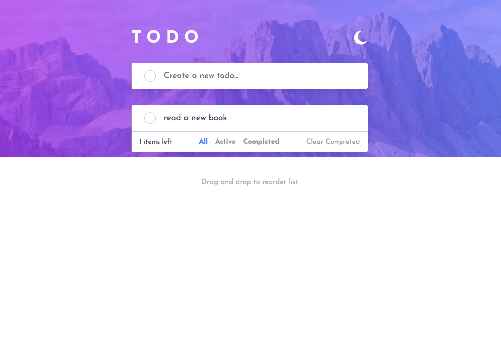
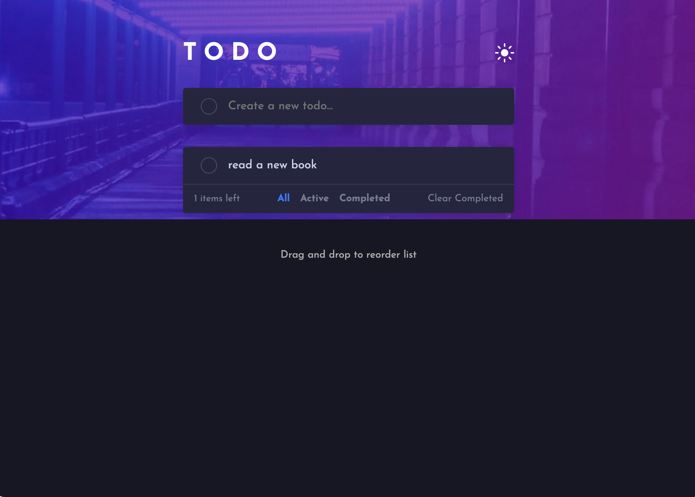

# Todo App  

A responsive and interactive **Todo App** that allows users to manage tasks efficiently. This project was built as part of a **Frontend Mentor** challenge to improve front-end development skills and demonstrate clean, maintainable code practices.  

## 🔗 Live Demo & Repository  

- **Live Website**: [Todo App](https://todo-asl.netlify.app/) 
- **GitHub Repository**: [GitHub Repo](https://github.com/Mouadasel/To-Do-App/)

## Features  

### 🌗 **Theme Switching**  
- Toggle between light and dark modes for better usability and visual appeal.  

### ✅ **Task Management**  
- Add, edit, mark as completed, and delete tasks dynamically.  
- Display counts for tasks remaining to be completed.  

### 📂 **Task Categorization**  
- View tasks filtered by "All," "Active," and "Completed" categories.  
- Clear all completed tasks in one click.  

### 🖱️ **Drag-and-Drop Reordering**  
- Reorder tasks easily via drag-and-drop functionality.  

### 📱 **Responsive Design**  
- Fully responsive layout that adapts to different screen sizes.  
- Optimized UI behavior for mobile screens under 460px.  

### 🎹 **Keyboard Accessibility**  
- Add tasks by pressing "Enter" for improved keyboard support.  

## Tech Stack  

- **HTML**: Semantic structure for better accessibility.  
- **CSS**: Styled with custom design and responsive techniques.  
- **JavaScript**: Handles dynamic interactivity, task management, and drag-and-drop functionality.  

## Usage  

1. **Add a Task**: Type in the input field and press **Enter** to add a new task.  
2. **Mark as Complete**: Click the task to toggle its completion status.  
3. **Filter Tasks**: Use the "All," "Active," or "Completed" buttons to view specific tasks.  
4. **Reorder Tasks**: Drag and drop tasks to change their order.  
5. **Clear Completed Tasks**: Click the "Clear Completed" button to remove all completed tasks.  
6. **Switch Theme**: Toggle between light and dark themes using the theme switcher.  

## Screenshots  

### Light Theme  
  

### Dark Theme  

